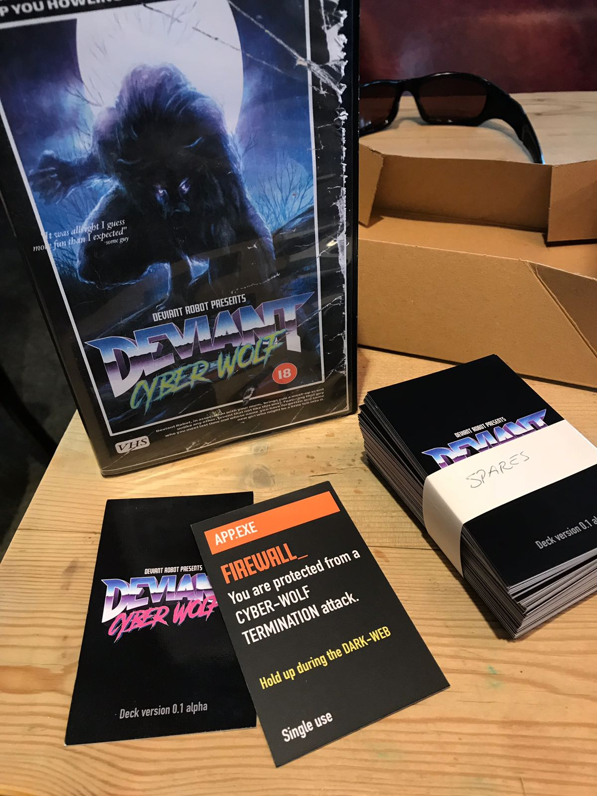

Created Deviant as part of the Deviant Robot project Deviant Cyberwolf is a group deduction game based on the game Werewolf; it featured an 80s retro futurism aesthetic

<figure class="block-image">

<figcaption>

Deviant Cyberwolf is about trying to identify the hidden identity of each player is, specifically if a player is one of a small number of "Cyberwolves". The wolf human question make situate I think perfectly capture this narrative.

The tagline "Online and out of time" is a homage to the classic low budget taglines of 80s horror and science-fiction but also alludes to the nature of the game which is in essence a race against time.

</figcaption>

</figure>

<figure>

<figcaption>
The Soundwave application was created in React and Electron using the Howl audio engine. It was used to enhance the game experience of the game by playing ambient and game relevant audio during events.
</figcaption>

</figure>

<figure>

<figcaption>
The VSH cassette cover was created to support the 80s asthenic and ac as a case for the game cards.
</figcaption>

</figure>

<figure>

<figcaption>
An early prototype, the imagery on the cover invokes a feeling of low budget 80s horror moves.
</figcaption>

</figure>

<figure>

</figure>

