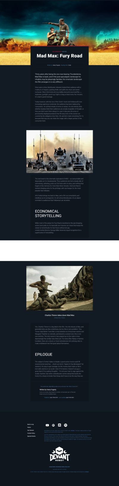

William Owen created Deviant Robot back in 2014 and the website and community have gone through a number of iterations and evolutions since then. The project was placed on hold beginning of 2019 and rebooted in 2021.

