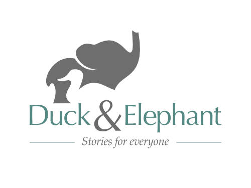
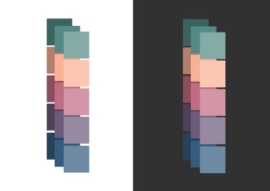
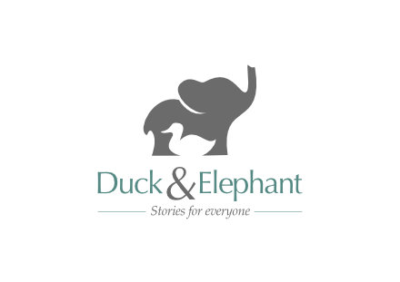
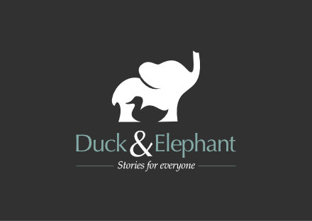
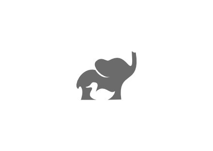
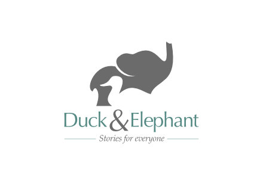
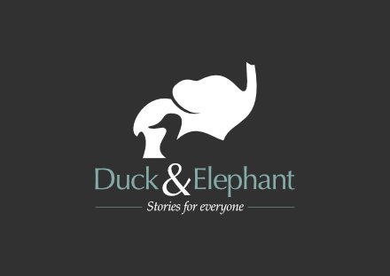
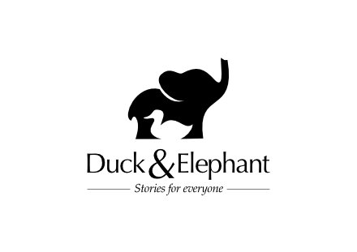
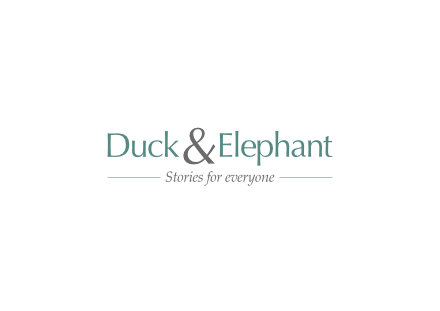
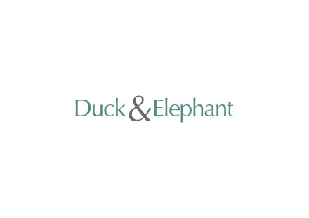

Oh Zoe books is a custom book publishing company that creates personalised books for children.

After discuss the brand with the owner I created the following creatives and brand name concepts. I wanted to address the ambiguous phonetics of the name and create a logo concept that would be elegant and child friendly.

<figure class="block-image block-white">

<figcaption>

After several conversations I discovered that "Duck" and "Elephant" were nicknames the company owners had for each other; and as a result I came up with this creative concept.

I felt that the tag line "Stories for everyone" neatly encapsulated the mission of the company, to create personalised stories that allowed for greater representation and inclusivity.

</figcaption>

</figure>

<figure>

<figcaption>
I selected a colour pallet that was deliberately soft yet colourful; this would allow the bold and bright imagery of the children's books to stand out without clashing with the brand materials.
</figcaption>

</figure>

<figure>

</figure>

<figure>

</figure>

<figure>

</figure>

<figure>

<figcaption>
An alternative of the logo using more significant negative space an allowing for a more distinct silhouette.
</figcaption>

</figure>

<figure>

</figure>

<figure>

<figcaption>
A logo should always be effective in a single colour.
</figcaption>

</figure>

<figure>

</figure>

<figure>

</figure>

