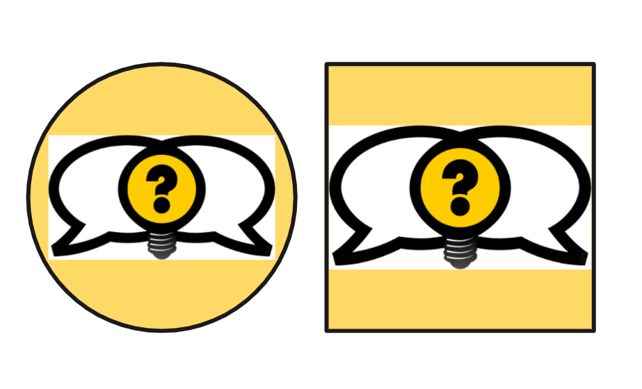

Street Epistemology is a movement created to promote reflecting on beliefs through friendly conversations. Based on the Socratic method of using questions to promote self reflection, the term Street Epistemology was coined by Peter Boghossian in his book 'A Manual for Creating Atheists'. It should be noted that despite the title of the book; Street Epistemology is not explicitly about religious beliefs or promoting any particular belief.

The original Street Epistemology logo was created through an open request for submissions and a public vote to select the winner and the resulting design has been widely adopted. However, I have felt the logo had some fundamental issues that could be improved upon and the following is an exploration of those issues and an alternative logo which I have made freely available to the community.

## Analysis of the original Street Epistemology logo

The original Street Epistemology logo created a great visual metaphor for conversations leading to ideas. The logo is bold and direct.

The design takes the key concept of the the conversation inspiring ideas using the same light bulb metaphor.

<figure class="block-image block-white">

<figcaption class="center">

The original Street Epistemology logo.

</figcaption>

</figure>

### The Lightbulb

The Lightbulb metaphor is a nice one, representing ideas and realisations resulting from the conversation.

The form of the Light Bulb is slightly unusual, the circle shape doesn't read easily as a light bulb.

The fine detail and gradient of the screw fit bulb gets lost at small scale and result in the feeling of a blurry spot on the image.
### The Question mark

Whilst question are critical component the Street Epistemology method. The visual metaphor appears to be that when people talk it leads to questions. Questions could be interpreted as introspection but as a symbol the question marks is more can also be associated with uncertainty or confusion.

Small design inflections on the question mark will get lost at small scale and result in a blurry feel to the image.

### The Colour Pallet

The design uses three solid colors Bold high contrast colors black, white, yellow/orange. These colours are most commonly associated with construction, and warning signage.

<figure class="block-image block-white">

<figcaption>

The current design has an aspect ratio of approximately 9:5. This makes it difficult to use this logo on social media where logos are often placed in squares or circles.

</figcaption>

</figure>

## A new Street Epistemology logo

This alternative is an **evolution** of the existing logo. As a result it could still be recognisable to those who have only seen the original Street Epistemology logo. The design takes the key concept of the the conversation inspiring ideas using the same light bulb metaphor.

<figure class="block-image block-white">

<figcaption class="center">

The a new Street Epistemology logo concept by wo.dev

</figcaption>

</figure>

The question mark has been removed and the form of the light bulb has been refined to make it more immediately recognisable as a light bulb. New colors have been introduced. To brighten the feel and make it more friendly.

The design has an aspect ratio of approximately 5:4 which makes it work well on social media where logos are often placed in squares or circles.

### Open source

The logo has been made open source, and is freely available to use. The latest version can be found here https://github.com/William-Owen/street-epistemology-logo

